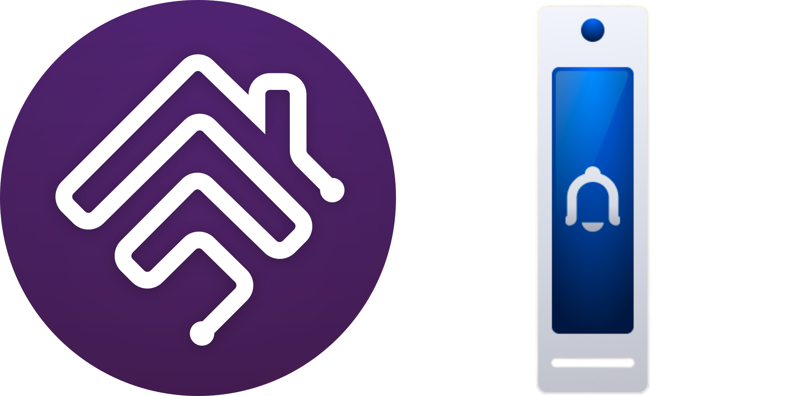

# Homebridge UniFi Access

Complete HomeKit support for the [UniFi Access](https://ui.com/door-access) ecosystem using [Homebridge](https://homebridge.io).

`@mp-consulting/homebridge-unifi-access` is a [Homebridge](https://homebridge.io) plugin that provides HomeKit support to the [UniFi Access](https://ui.com/door-access) device ecosystem. [UniFi Access](https://ui.com/door-access) is [Ubiquiti's](https://www.ui.com) door access security platform, with doorbell, reader, lock, and controller hardware options for you to choose from, as well as an app which you can use to view, configure and manage your door access security.

### UniFi Access Events

The UniFi Access controller communicates state changes through a WebSocket-based event system. Each event is delivered as a JSON packet containing an event type, a target object identifier, and a data payload. This document describes each event type, its payload structure, and how the plugin processes it.

### Event Envelope

All events share a common envelope structure:

| Field | Type | Required | Description |
|-------|------|----------|-------------|
| `event` | string | Yes | Event topic (e.g. `access.data.device.update`). |
| `event_object_id` | string | Yes | Identifier of the device or location that generated the event. |
| `data` | object | Yes | Event-specific payload. Structure varies by event type. |
| `receiver_id` | string | No | Controller or target identifier. |
| `save_to_history` | boolean | No | Whether the controller persists this event in history. |
| `meta` | object | No | Additional metadata (V2 events). |
| `meta.object_type` | string | No | Object type (`device`, `location`). |
| `meta.source` | string | No | Event origin (`controller`). |
| `meta.target_field` | array | No | List of fields that changed. |

---

### DEVICE_UPDATE

**Topic:** `access.data.device.update`

Fired when a device's configuration or state changes. This is the primary V1 event for device status including online/offline transitions, lock state, door position sensor (DPS) state, and terminal input updates.

**Data payload:** Full `AccessDeviceConfig` object. Key fields used by the plugin:

| Field | Type | Description |
|-------|------|-------------|
| `is_online` | boolean | Device connectivity status. |
| `alias` | string | User-assigned device name. |
| `extensions` | array | Device extensions, including proxy mode terminal input configuration for UA Ultra. |

**Plugin behavior:**
  * Updates the HomeKit `StatusActive` characteristic when online/offline state changes.
  * Syncs the device name in HomeKit if the `Device.SyncName` feature option is enabled.
  * Processes lock state and DPS state changes for the main door and side door (UA Gate).
  * Processes terminal input state updates (Dps, Rel, Ren, Rex sensors).
  * Detects proxy mode terminal input configuration changes on UA Ultra devices.

---

### DEVICE_UPDATE_V2

**Topic:** `access.data.v2.device.update`

V2 event for access method capability changes and location state updates (primarily UA Gate hubs with multiple doors).

**Data payload:**

#### `access_method` (object, optional)

Reports which access methods are enabled or disabled on a device.

| Field | Type | Description |
|-------|------|-------------|
| `apple_pass` | `"yes"` \| `"no"` | TouchPass (Apple Wallet). |
| `bt_button` | `"yes"` \| `"no"` | Mobile app unlock. |
| `face` | `"yes"` \| `"no"` | Face recognition. |
| `nfc` | `"yes"` \| `"no"` | NFC card. |
| `pin_code` | `"yes"` \| `"no"` | PIN code. |
| `qr_code` | `"yes"` \| `"no"` | QR code. |
| `wave` | `"yes"` \| `"no"` | Hand wave. |

#### `location_states` (array, optional)

Per-door state for multi-door hubs (UA Gate).

| Field | Type | Required | Description |
|-------|------|----------|-------------|
| `location_id` | string | Yes | Door/location identifier. |
| `lock` | `"locked"` \| `"unlocked"` | Yes | Lock state. |
| `dps` | `"open"` \| `"close"` | Yes | Door position sensor state. |
| `dps_connected` | boolean | Yes | Whether the DPS sensor is connected. |
| `enable` | boolean | Yes | Whether the location is enabled. |
| `is_unavailable` | boolean | Yes | Whether the location is unavailable. |
| `emergency` | object | No | Emergency mode information. |
| `hub_gate_door_mode` | string | No | Gate door mode (UA Gate only). |
| `manually_action_button_number` | number | No | Manual action button number. |
| `alarms` | array | No | Active alarms for this location. |

**Plugin behavior:**
  * Updates HomeKit switch characteristics for each access method when capabilities change.
  * For UA Gate hubs, processes `location_states` to update the main and side door lock/DPS state.
  * Skips updates during gate transitions (5-second cooldown) to avoid noisy intermediate states.

---

### DEVICE_REMOTE_UNLOCK

**Topic:** `access.data.device.remote_unlock`

Fired when a device is remotely unlocked (via the UniFi Access app, API, or HomeKit).

**Data payload:** Empty object.

**Plugin behavior:**
  * For UA Gate hubs, the hub event bus determines which door was unlocked based on `event_object_id`.
  * Triggers an automatic re-lock after a 5-second delay.

---

### LOCATION_DATA_UPDATE

**Topic:** `access.data.location.update`

V1 event for location metadata and configuration changes (door names, schedules, etc.).

**Data payload:**

| Field | Type | Required | Description |
|-------|------|----------|-------------|
| `name` | string | Yes | Location/door name. |
| `unique_id` | string | Yes | Unique location identifier. |
| `full_name` | string | No | Full hierarchical name. |
| `level` | number | No | Hierarchy level. |
| `location_type` | string | No | Type of location (e.g. `door`). |
| `timezone` | string | No | Time zone. |
| `extras` | object | No | Additional metadata. |
| `extra_type` | string | No | Metadata type. |
| `previous_name` | string \| array | No | Previous name(s) before a rename. |
| `up_id` | string | No | Parent location identifier. |
| `work_time` | string | No | Operating hours configuration. |
| `work_time_id` | string | No | Work time schedule identifier. |

---

### LOCATION_UPDATE

**Topic:** `access.data.v2.location.update`

V2 event for door/location state changes including lock and DPS updates. Primarily used by UA Gate hubs.

**Data payload:**

| Field | Type | Required | Description |
|-------|------|----------|-------------|
| `id` | string | Yes | Location/door identifier. |
| `name` | string | Yes | Location/door name. |
| `device_ids` | array | No | Associated device identifiers. |
| `location_type` | string | No | Type of location. |
| `last_activity` | number | No | Timestamp of last activity. |
| `extras` | object | No | Additional metadata. |
| `thumbnail` | object | No | Thumbnail image data. |
| `up_id` | string | No | Parent location identifier. |

#### `state` (object, optional)

| Field | Type | Description |
|-------|------|-------------|
| `lock` | `"locked"` \| `"unlocked"` | Lock state. |
| `dps` | `"open"` \| `"close"` | Door position sensor state. |
| `dps_connected` | boolean | DPS sensor connectivity. |
| `enable` | boolean | Whether the location is enabled. |
| `is_unavailable` | boolean | Whether the location is unavailable. |

**Plugin behavior:**
  * Only processed for UA Gate hubs that use the location-based API.
  * Updates lock and DPS state for the main and side doors.
  * Skips updates during gate transitions (5-second cooldown).

---

### DOORBELL_RING

**Topic:** `access.remote_view`

Fired when someone presses the doorbell button on an Access reader.

**Data payload:**

| Field | Type | Required | Description |
|-------|------|----------|-------------|
| `request_id` | string | Yes | Unique ring identifier (used to match cancellation). |
| `device_id` | string | Yes | Hub/reader device identifier. |
| `device_name` | string | Yes | Device name. |
| `device_type` | string | Yes | Device type (e.g. `UAH`). |
| `door_name` | string | Yes | Door/location name. |
| `floor_name` | string | Yes | Floor name. |
| `room_id` | string | Yes | Room/location identifier. |
| `controller_id` | string | Yes | Controller identifier. |
| `connected_uah_id` | string | Yes | Connected hub unique identifier. |
| `connected_uah_type` | string | Yes | Connected hub type. |
| `host_device_mac` | string | Yes | MAC address of the host device. |
| `in_or_out` | string | Yes | Direction (`in` or `out`). |
| `reason_code` | number | Yes | Reason code for the ring. |
| `create_time` | number | Yes | Unix timestamp (seconds). |
| `channel` | string | Yes | Video channel identifier. |
| `token` | string | Yes | Authentication token for video stream. |
| `clear_request_id` | string | Yes | Clear/cancel request identifier. |
| `door_guard_ids` | array | Yes | Associated guard/user identifiers. |
| `support_feature` | array | Yes | Supported features (e.g. `["video", "audio"]`). |

**Plugin behavior:**
  * Triggers a HomeKit `ProgrammableSwitchEvent.SINGLE_PRESS` on the Doorbell service.
  * Stores the `request_id` for matching with a subsequent `DOORBELL_CANCEL` event.
  * Emits a `doorbell:ring` event on the hub event bus (consumed by MQTT and trigger switches).

---

### DOORBELL_CANCEL

**Topic:** `access.remote_view.change`

Fired when a doorbell ring is cancelled (timeout, user stops ringing, etc.).

**Data payload:**

| Field | Type | Required | Description |
|-------|------|----------|-------------|
| `reason_code` | number | Yes | Reason code for the cancellation. |
| `remote_call_request_id` | string | Yes | Matches the `request_id` from the corresponding `DOORBELL_RING`. |

**Plugin behavior:**
  * Only processed if `remote_call_request_id` matches the stored doorbell ring request.
  * Emits a `doorbell:cancel` event on the hub event bus (consumed by MQTT and trigger switches).

---

### TOP_LOG_UPDATE

**Topic:** `access.data.top_log.update`

Periodic log analytics summary sent by the controller.

**Data payload:**

| Field | Type | Required | Description |
|-------|------|----------|-------------|
| `buckets` | object | No | Log analytics buckets. |
| `hits` | object \| array | Yes | Log hit data. May be an object or array depending on the query type. |

**Plugin behavior:** Not directly consumed by the plugin. Used for controller health monitoring.

---

### BASE_INFO

**Topic:** `access.base.info`

Periodic heartbeat sent by the controller to indicate it is online.

**Data payload:**

| Field | Type | Required | Description |
|-------|------|----------|-------------|
| `top_log_count` | number | Yes | Current count of top-level log entries. |

**Plugin behavior:** Not directly consumed by the plugin. Used for controller connectivity monitoring.

---

### LOGS_ADD

**Topic:** `access.logs.add`

Fired when a new activity log entry is created (access attempts, lock/unlock actions, etc.).

**Data payload:**

| Field | Type | Required | Description |
|-------|------|----------|-------------|
| `_id` | string | Yes | Log entry unique identifier. |
| `@timestamp` | string | Yes | ISO 8601 timestamp. |
| `_source` | object | Yes | Source context with detailed access/event data. |
| `tag` | string | Yes | Activity tag/category. |

**Plugin behavior:** Not directly consumed by the plugin.

---

### LOGS_INSIGHTS_ADD

**Topic:** `access.logs.insights.add`

Fired when the controller generates an insight about access patterns or anomalies.

**Data payload:**

| Field | Type | Required | Description |
|-------|------|----------|-------------|
| `event_type` | string | Yes | Type of insight event. |
| `log_key` | string | Yes | Unique log key identifier. |
| `message` | string | Yes | Human-readable insight message. |
| `published` | number | Yes | Timestamp (milliseconds). |
| `result` | string | Yes | Insight result/outcome. |
| `metadata` | object | No | Additional context. |

**Plugin behavior:** Not directly consumed by the plugin.
